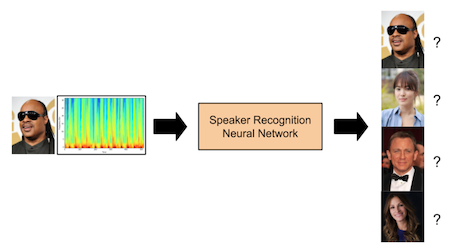
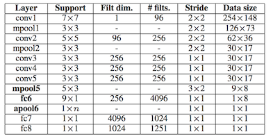

# [HW3] Speaker Recognition with DL Frameworks

**Due Nov. 20 (Mon), 6pm**

******(IMPORTANT) Start downloading datasets (~9GB) ahead of time!******

******(Nov 3): Updated description on the data format of binary files + clarification on the length/frequency of the samples/test dataset.******

The last, but not least, programming assignment is to conduct **speaker recognition** - identifying a speaker from short speech segments - using the deep learning (DL) frameworks TensorFlow or Caffe2. You will implement convolutional neural networks based on known models, such as the VGG-M network, atop of TensorFlow or Caffe2, and train the models using the recently published VoxCeleb dataset. Compare the accuracy of your trained models with the results in the reference paper, describing how they differ and why. Also, you will analyze how adjusting the training setup (batch size, learning rate, model parameters, etc.) affects various aspects including, but not limited to, training speed, inference speed, model accuracy, and more. Although this assignment can be done solely on CPUs, a server equipped with a GPU accelerator is *strongly* suggested. A training session that would take an hour or two with a GPU device may take as long as a few days if done on only CPU.

## Task: Speaker Recognition
Speaker recognition (voice recognition) refers to the task of identifying a person from their voice. It is often confused with speech recognition; speaker recognition involves figuring out *who* is speaking, whereas the latter indicates analyzing *what* is being said. Speaker recognition is widely used in two large categories of applications: *identification* (e.g. automatic subtitle generation for videos) and *verification* (e.g. user verification on personal IoT devices). In this assignment, we will focus on usages for identification.

The following image is a simple illustration of the identification problem. Given an audio segment of an unknown person speaking, a neural network processes the data and predicts who the speaker is. In a sense, this problem can be considered as a classification problem, where each possible class corresponds to a specific person.

<p align="center">
  
</p>


## Dataset: VoxCeleb
You will use the VoxCeleb [6] dataset, which is basically a very large group of audio segments from YouTube with annotations about the speaker. The original dataset consists of over 100k utterances with varying lengths, from a total of 1,251 celebrities. For the sake of preventing the dataset size from becoming insanely big, the TA team has sampled data from a randomly picked cast of 50 people out of the original 1,251. The following files will be provided for your convenience.

* `voxceleb-abridged-N.bin` (N=1, 2, …, 6)
  * URL (download with any data transfer tool like `curl`) : `https://s3.ap-northeast-2.amazonaws.com/snu-bd2017-hw3/voxceleb-abridged-N.bin` (N=1, 2, …, 6)
  * Preprocessed spectograms of 17,460 wav files (all 3.015 seconds long, 16kHz), in binary format and in no particular order.
  * About 9GB in total. (~1.5GB each)
  * Each data instance is a 2d float32 array of [512, 300] dimensions.
  * Both TensorFlow and Caffe2 provide APIs for reading such binary-formatted files. Use them!
  * Split the datasets into train/test or train/dev/test subsets, as you wish.
  * Format: an int32 class label followed by 512*300 float32s, for each data instance. There are no whitespaces between values, and no line breaks between instances.
  * **Note: The int32 label is serialized as a float32. Read the label as a float32, then cast it back into a int32.**

```
[data0_class] [data0(0,0)] [data0(0,1)] … [data0(511,299)]
[data1_class] [data1(0,0)] [data1(0,1)] … [data1(511,299)]
…
```


* `voxceleb-abridged-classes.txt`
  * A list of class labels (0~49) for each speaker in the dataset. The mapping in this file was the one used when labeling the spectograms.
```
0 Miley_Cyrus
1 Hye-kyo_Song
2 Stevie_Wonder
3 Tilda_Swinton
…
```


* `voxceleb-abridged-samples.tar.gz`
  * URL (download with any data transfer tool like `curl`) : [`https://s3.ap-northeast-2.amazonaws.com/snu-bd2017-hw3/voxceleb-abridged-samples.tar.gz`](https://s3.ap-northeast-2.amazonaws.com/snu-bd2017-hw3/voxceleb-abridged-samples.tar.gz)
  * 150 sample wav files (3 per speaker, all 3.015 seconds long, 16kHz) that you can play and listen to, and their corresponding spectograms.
  * About 93MB.
  * For example,
```
$ ls samples/James_Nesbitt/
GgYuyVluakM_002.bin R8B7yQKbsC0_055.bin eElDKxy7lnQ_002.bin
GgYuyVluakM_002.wav R8B7yQKbsC0_055.wav eElDKxy7lnQ_002.wav
```

## Model: Convolutional Neural Network
The VoxCeleb paper [7] proposes a standard convolutional neural network (CNN) based on the VGG-M network [1] that is able to learn the abstract features of the VoxCeleb dataset and correctly classify test audio segments with decent accuracy. Your job is to reproduce the results. Carefully read through sections 5 & 6 of the paper and implement the proposed CNN model. Note that after every convolutional layer (conv) and fully connected layer (fc), an element-wise relu nonlinearity is inserted (except the final layer, which has a softmax layer instead).

<p align="center">
  
</p>


Aside from the model above, you must also pick and implement another neural network model to perform the same speaker recognition task. This second neural network does not necessarily have to perform better than the VGG-M model; rather, you should implement a model that is clearly distinct from VGG-M so that interesting results for analysis can be observed. Moreover, this second network does not have to based on a well-known model. You may creatively propose a new architecture that you think may perform better than VGG-M. Just make sure you describe the details in your report (see below).

## Framework: TensorFlow & Caffe2
TensorFlow [2, 3] and Caffe2 [4, 5] are currently two of the most popular frameworks in the deep learning industry and academia. Both frameworks provide helpful tutorials and examples that you should go through. Choose a framework of your choice and use it to implement your models.

## Performance Analysis
Although two completely different neural networks can be applied to the same task, it is not uncommon for them to produce different training results. For this assignment, you will write and submit a short report containing the training results of your models as well as your analysis on why such results were obtained. Be sure to include at least training speed (instances per second), inference speed (instances per second), and test accuracy (%) results in your report. Also, experiment with various training setups (batch size, learning rate, # of model parameters, etc.) and describe how this affects the training results.

You are not obliged to list every single model difference; rather, focus on the most important aspects that significantly affect performance. Your report should be at most three pages. Note that you will not receive any extra points for simply reaching the page limit with bland, uninteresting analysis results. Only use more than one page when you truly run out of space. Also, include the CPU (and/or GPU) specs you used for the assignment.

## Submission
* Due: Nov. 20 (Mon), 6pm
* Upload the following to your private repository from the previous assignments, `master` branch
  * Code (Python files) and report (pdf)
  * Short README on how to run your code
  * Pretrained TensorFlow/Caffe2 models that can be loaded for testing (you may have to compress your files into several partitions due to GitHub’s file size limits)
  * DO NOT upload the training data (about 9GB)
  * DO NOT upload TensorFlow & Caffe2 source code, unless you have a very good reason to do so (e.g. fatal bug)
* We will take a snapshot of your repository just after the deadline and use that for grading
  * We will have TensorFlow v1.3.0 and Caffe2 v0.8.0 installed while running your code
* Please let us know (bd-ta@spl.snu.ac.kr) if
  * Your code requires any other version of TensorFlow or Caffe2
  * Your files (models) are too big to be uploaded to GitHub
  * You plan to make a late submission
  * You have not notified the TAs of your repository (e.g. did not submit previous assignments)


## Grading Criteria
* TensorFlow/Caffe2 model script runs without errors
* TensorFlow/Caffe2 model is trainable, to an acceptable degree
* Report contains reproducible training results
  * Include screenshots of your training results
  * At least 25% test accuracy should be achieved
  * We will also check your models on a separate unreleased test dataset to verify the numbers in your report (the test dataset is in the same format as the other given datasets; binarized spectograms of wav files that are 3.015 seconds long, 16kHz)
* Report contains interesting analysis on models as well as tuning parameters


### References
[1] K. Chatfield, et al. "Return of the devil in the details: Delving deep into convolutional nets." BMVC, 2014.

[2] https://www.tensorflow.org/

[3] M. Abadi, et al. "TensorFlow: A System for Large-Scale Machine Learning." OSDI, 2016.

[4] https://caffe2.ai/

[5] P. Goyal, et al. "Accurate, Large Minibatch SGD: Training ImageNet in 1 Hour." arxiv preprint arXiv:1706.02677, 2017.

[6] http://www.robots.ox.ac.uk/~vgg/data/voxceleb/

[7] A. Nagrani, et al. "VoxCeleb: a large-scale speaker identification dataset." INTERSPEECH, 2017.

